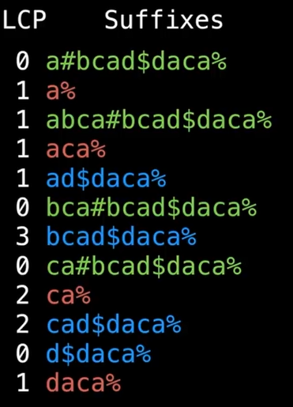
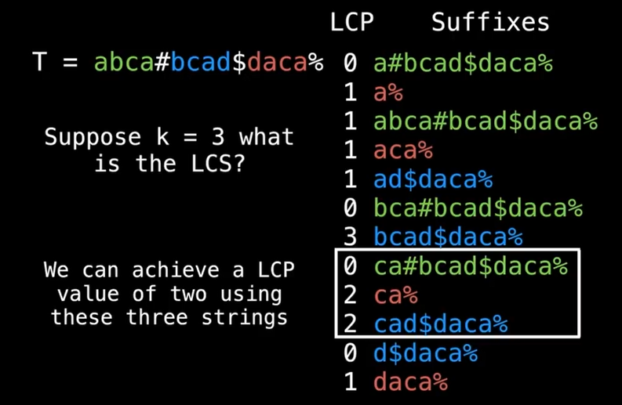
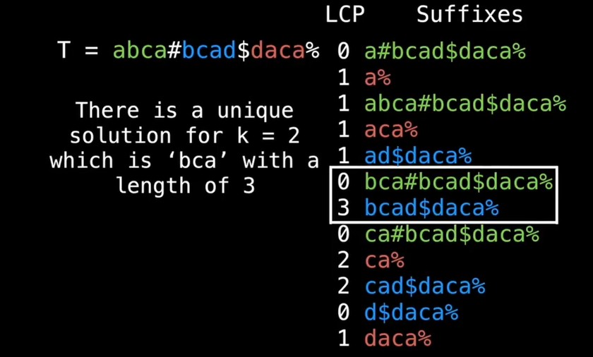
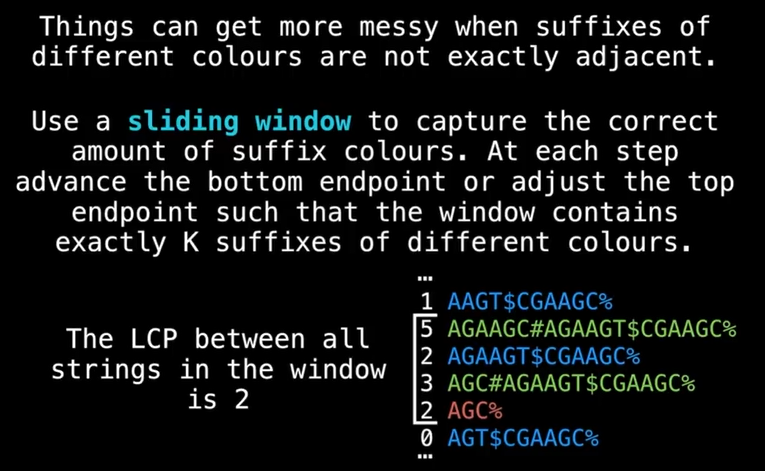
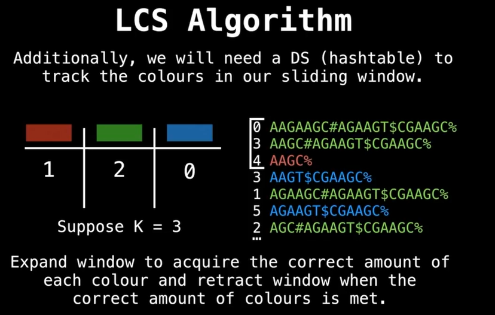

# Suffix Arrays

## What is a suffix?

A substring at the end of the string.

## What is a suffix array (SA)?

Array containing all the sorted suffixes of a string.

"Camel"

**All suffixes**

| num | suffix |
|-----|--------|
| 0   | camel  |
| 1   | amel   |
| 2   | mel    |
| 3   | el     |
| 4   | l      |

**All suffixes in lexicographic order**

| num | suffix |
|-----|--------|
| 1   | amel   |
| 0   | camel  |
| 3   | el     |
| 4   | l      |
| 2   | mel    |

The actual suffix array is the array of sorted indices. This provides a
compressed representation of the sorted suffixes without actually needing to
store the suffixes.

# Longest Common Prefix Array (LCP)

LCP array of `ababbab`


| Sorted Index | LCP Value | Suffix |
|--------------|-----------|--------|
| 5            | 0         | ab     |
| 0            | 2         | ababbab|
| 2            | 2         | abbab  |
| 6            | 0         | b      |
| 4            | 1         | bab    |
| 1            | 3         | babbab |
| 3            | 1         | bbab   |

LCP Array = {0,2,2,0,1,3,1}

How many characters two sorted adjecent suffixes have in common.

By convention, LCP[0] is undefined, usually set to zero.

**Note**: There exists many methods for efficiently constructing the LCP array
in O(nlogn) time and even in O(n) time.


# Using SA/LCP array to find unique substring

## Usage (Finding and Counting unique substrings)

Finding and counting unique substring. (Bioinformatics, Computer Science)

Naive Algo : O(n^2)

LCP Array provides a better way.

Example: `AZAZA`

All n(n+1)/2 substrings:

A, AZ, AZA, AZAZ, AZAZA, Z, ZA, ZAZ, ZAZA, A', AZ', AZA', AZAZ'

| LCP | Sorted Suffixes (lex) |
|-----|-----------------------|
| 0   | A                     |
| 1   | AZA                   |
| 3   | AZAZA                 |
| 0   | ZA                    |
| 2   | ZAZA                  |

**Finding unique substrings**

```
n(n+1)/2 - sum(LCP[i])
```

If text = `AZAZA`, n = 5

5(5+1)/2 - sum (LCP(i)) = 9

9 unique substring.

# Longest Common Substring (LCS) 

## Problem Statement

*Suppose we have n strings, find the longest common substring that appears in*
*atleast 2<=k<=n of the strings.*

Consider n=3, k=2, with:

S1 = `aBCA`
S2 = `BCAd`
S3 = `daca`

Dynamic Programming is the traditional way with complexity O(n1*n2*n3*...*nm).

Alternative method is use a suffix array.


Consider again

S1 = `abca`
S2 = `bcad`
S3 = `daca`

To find the LCS, first create a new larger string T which is the concatation of
all the strings si separated by unique sentinels.

```
T = s1+"#"+s1+"$"+s3+"%"
  = abca#bcad$daca%
```

**Note:** The sentinels must be unique and lexicographically less than any of
the characters contained in any of the strings si.

Now create the suffix array and ignore the ones beginning with any of the sentinels.



### Longest common solution for k = 2

We need three suffixes (3 colors) with the max value



the string `ca` of length 2.

### Longest common solution for k = 2



The substring belongs to s1, s2 and s3


## Sliding window technique

In case the colors are not next to each other.



For each valid window, perform a range query on the LCP array bw the bottom and
top endpoints. The LCS will be the maximum LCP value for all possible windows.

The min sliding range query problem can be solved in a total of O(n) time for
all windows!

Alternatively, can use min range query DS such as a *segment tree* to perform
queries in log(n) time which may be easier but slightly slower running for a
total of `O(nlogn)`



When missing colors in the ARRAY, expand window. Perform query.

When having enough colors, reduce window size. Perform query.

When having enough colors, reduce window size. Cannot perform query (green is
not there). So expand window.


