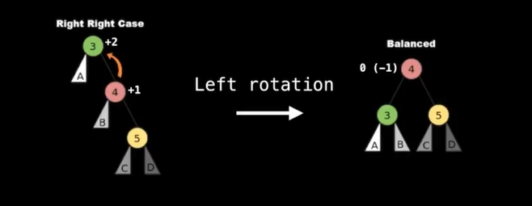

# Balanced Binary Search Trees (BST)

## What is it?

Self balancing BST. This type of tree will adjust itslef in order to maintain a
low (logarithmic) height allowing for faster operations like insert and delete.

## Complexity

| Operation | Average | Worst(BBST) | Worst (BST) |
|-----------|---------|-------------|-------------|
| Insert    | O(logn) | O(logn)     | O(n)        |
| Delete    | O(logn) | O(logn)     | O(n)        |
| Remove    | O(logn) | O(logn)     | O(n)        |
| Search    | O(logn) | O(logn)     | O(n)        |


# Tree Rotations

**Tree Invarient**: is a rule imposed on the tree.

**Tree Rotations**: Operations performed to maintain **Tree Invarient**


Suppose the invarant is not satisfied, to fix this, we need to right rotate node A

We but B where A was, and push A down to be B's child!

```
     A                        B
    / \     Right Rot        / \
   B   C    --------->      D   A
  / \       <---------         / \
 D   E       Left Rot         E   C

```

*Why are you allowed to change the structure of a tree like this?*

In the left tree, we know that D < B < E < A < C, and this remains true for the
right subtree. So we didn't break the BST invariant, therefore, its a valid
TRANSFORMATION.

For every node n, `n.left < n` and `n < n.right`.

It does not matter how the structure looks like, only that the invariant is
satisfied.

## Detail on rotations

```
      P (may or may not exist)
      :
      A
     / \
    B   C
   / \
  D   E
```

```
function rightRotate(A)
  B = A.left
  A.left = B.right
  B.right = A
  return B
```


```
      P (may or may not exist)
      :
      A
     /|\
    B | C
   /  |
  D   E
```

rearranging nodes


```
        P (may or may not exist)
        :
      B :
     / \:
    D   A
       / \
      E   C
```

If A exists, notice parent node P would still reference A. Set it to be B's
parent. (Using recursive callback on return value)

```
      P (may or may not exist)
      :
      B
     / \
    D   A
       / \
      E   C
```


### Doubly Linked BBST

If every node also references their parent node.

```
function rightRotate(A):
  P=A.parent
  B=A.left
  A.left=B.right
  if B.right != null
    B.right.parent = A
  B.right=A
  A.parent=B
  B.parent=P
  # Update parent down link
  if P!= null:
    if P.left == A:
      P.left=B
    else
      P.right=B
  return B
```

# Insert Elements into an AVL tree

A type of BBSTs which allows O(logn) insertion, deletion, search operation.

The Balance Factor: `BF(node = Height(node.right) - Height(node.left)`

Height = number of edges

**Node:** If tree has one node only, height is 1.

The INVARIANT in the AVL is that the balance factor can only be -1,0, or 1.


## Node Information to Store

* The actual value we're storing in the node. **Note** This value must be comparable.
* A value storing this node's balance factor.
* The height of this node in the tree.
* Pointers to the left/right child nodes.


Use tree rotations to maintain the BF.

## Rotations

### Case 1 : left left case


### Case 2: left right Case


### Case 2: right rigth Case




### Case 2: right left Case


## Inserting node to an AVL Tree

### Public Facing

```
function insert(value):
  if value==null:
    return false

  // only insert unique values
  if !contains(root, value):
    root = insert(root, value)
    nodeCount=nodeCount+1
    return true

  // value already exists in a tree
  return false
```

### Private Facing

```
function insert(value):
  if node==null: retrun Node(value)
  cmp=compare(value,node.value)
  if cmp<0:
    node.left=insert(node.left, value)
  else
    node.right=insert(node.right, value)

  update(node) // update balance factor and heights

  return balance(node)
```

```
function update(node):
  // variables for left/right subtree heights
  lh=-1
  rh=-1
  if node.left != null: lg = node.left.height
  if node.right != null: hg = node.right.height

  // Update this node's height
  node.height = 1+max(lh,h)

  // Updaet balance factor
  node.bf=rh-lh
```

``` 
function balance(node):
  # left heavy subtree
  if node.bf == -2:
    if node.left.bf<=0:
      return leftleftcase(node)
    else
      return leftrightcase(node)

  # right heavy subtree
  else if node.bf == +2:
    if node.right.bf>=0:
      return rightrightcase(node)
    else
      return rightleftcase(node)
  return node
```

```
function leftleftcase(node):
  return rightRotation(node)

function leftrightcase(node):
  node.left = leftRotation(node.left)
  return leftleftcase(node)

function rightright(node):
  return leftrotation(node)

function rightleftcase(node):
  node.right = rightRotation(node.right)
  return rightrightcase(node)
```

## AVL tree rotation methods

```
function rightRotate(A):
  B=A.left
  A.left=B.right
  B.right=A

  //After rotation, update balance factor and heights !
  update(A)
  update(B)
  return B
```

# Remove Elements from AVL Tree

1. Find the element to be removed

2. Replace the node we want to remove with its successor to maintain BST Invarant.

## Find Phase

Four things can happen

1. We hit a null node: value doesn't exist
1. Comparator Value = 0: found it
1. Comparator Value < 0, left subtree
1. Comparator Value > 0, right subtree

## Remove Phase

Four cases

1. Node to remove is a leaf node
1. Node to remove has a right subtree but no left subtree
1. Node to remove has a left subtree but no right subtree
1. Node to remove has a left and right subtree

**Case 1:** No side effects

**Cases 2 and 3:** The successor node is the immediate child

**Cases 4:** Both (Largest value in the left subtree or smallest value in right subtree

**Note:** Remove the duplicate value of the successor node that still exists.

# Augmenting BST removal for AVL tree

Only add two lines of code

```
function remove(node,value):
  ...
  # code for BST item removal
  ...

  # update balance factor
  update (node)

  # rebalance tree
  return balance(node)
```


