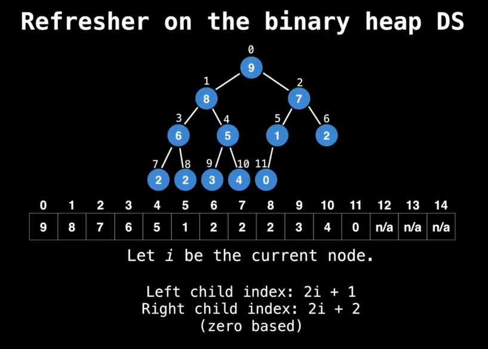
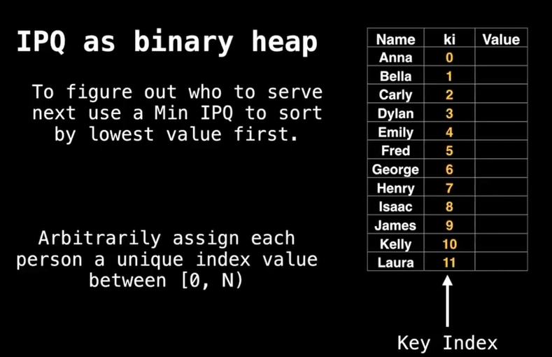
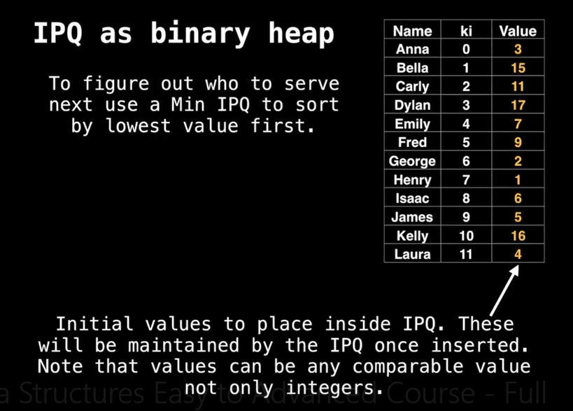
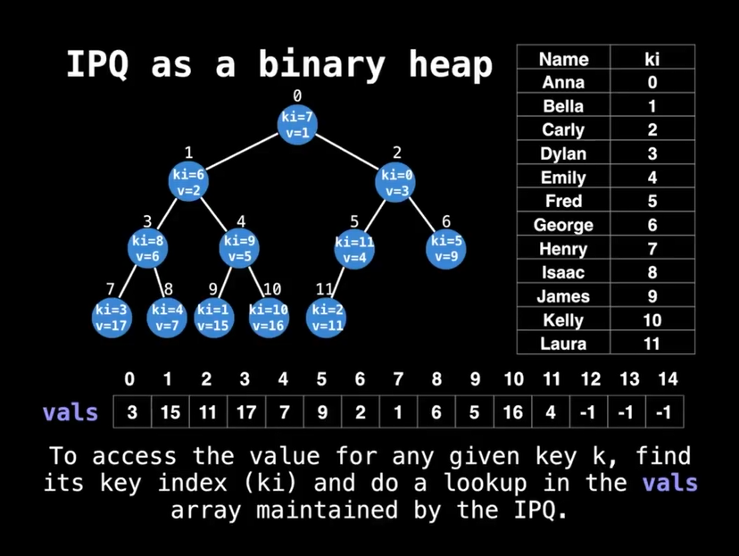
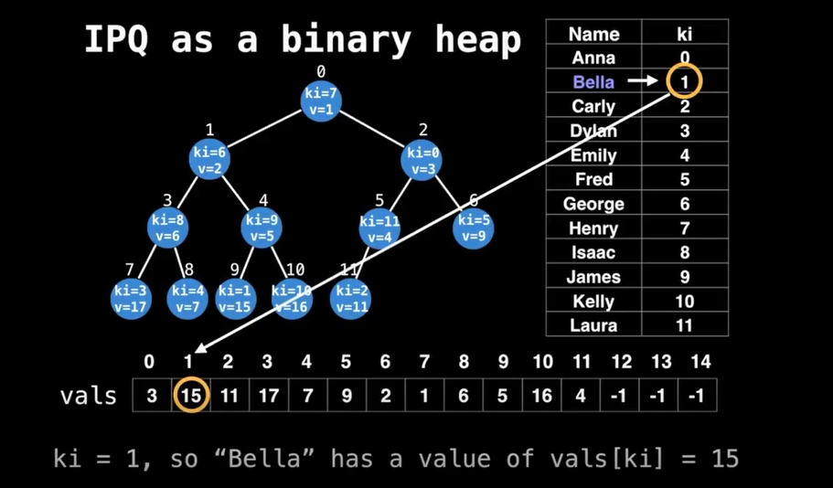
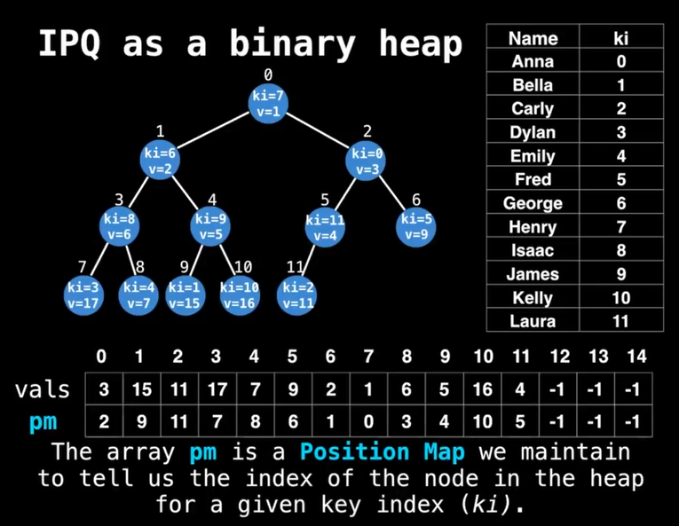
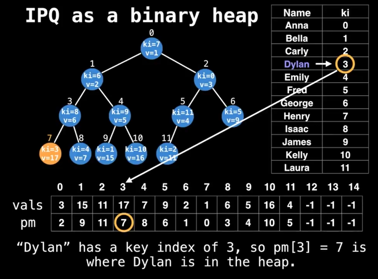
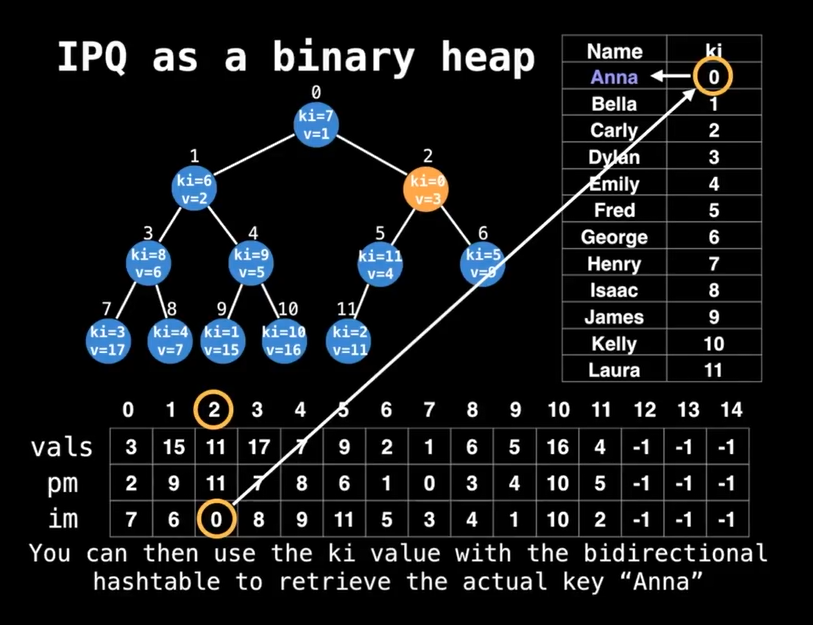
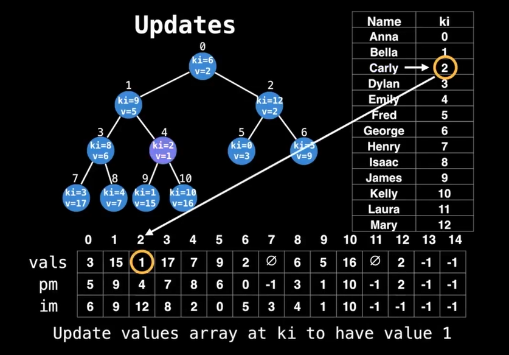

# Indexed Priotiry Queue

Is a regular PQ plus quick updates on Deletion of key-value pairs.

## Usefulness

Dynamically update the priority (value) of certain nodes (keys).

The IPQ data structure which lets us do this efficiently. Bidirectional
mapping required.

Create a bidirectional mapping between N keys and the domain [0,N) using a 
bidirectional hashtable

```

Key     |   Key Index (ki)
--------------------------
Mary      <----> 0
Akarsh    <----> 1
James     <----> 2
Naida     <----> 3
Richard   <----> 4
Leah      <----> 5
```

*Why are we mapping keys to indices in the domain [0,N)?*

Typically, priority queues are implemented as heaps under the hood which
internally use arrays which we want to facilitate indexing into.

**Note:** Often the keys themselcs are integers in the range [0,n) so there's
no need for the mapping, but it's handy to ba able to support any type of keys
(like strings)

## IPQ Abstract Data Type Interface

If 'k' is the key we want to update, first get the key's index: `ki=map[k]`,
then use `ki` with the IPQ

```
delete(ki)
valueOf(ki)
contains(ki)
peekMinKeyIndex(ki)
pollMinKeyIndex(ki)
peekMinValue()
PollMinValue()
insert(ki,value)
update(ki,value)
decreateKey(ki,value) // Special to IPQ
increaseKey(ki,value) // Special to IPQ
```

## IPQ as a binary heap

| Operation              | Indexed Binary Heap PQ   |
|------------------------|--------------------------|
| delete(ki)             |  O(logn)                 |
| valueOf(ki)            |  O(1)                    |
| contains(ki)           |  O(1)                    |
| peekMinKeyIndex(ki)    |  O(1)                    |
| pollMinKeyIndex(ki)    |  O(logn)                 |
| peekMinValue()         |  O(1)                    |
| PollMinValue()         |  O(logn)                 |
| insert(ki,value)       |  O(logn)                 |
| update(ki,value)       |  O(logn)                 |
| decreateKey(ki,value)  |  O(logn)                 |
| increaseKey(ki,value)  |  O(logn)                 |

## Binary Heap DS

Binary heaps as arrays:




## Indexed Priority Queue

The VALUES can dynamically change, and we will serve the node with the loweest
priority. (MinIPQ)









*What value does the key "Bella" Has in the IPQ?*



*How do we get the index of a node in a particular key?*

We need to maintain a **postion map** as an array (pm).



*Which node represents the key "Dylan"?*



*Inverse lookup: How do we fing the ki and key from the position of the node?*

Maintain an inverse lookup table. (Inverse map)

*Which person is represented at the node at index 2?*




### Insertion

```
function insert(ki,value):
  valuues[ki] = value
  pm[ki] = sz // sz is the current heap size
  im[sz] = ki
  swim(sz)
  sz = sz+1
```

```
function swim(i):
  for (p=(i-1)/2; i>0 and less(i,p))
    swap(i,p)
    i=p
    p=(i-1)/2

function swap(i,j):  // we are only swapping index values
  pm[im[j]]=i
  pm[im[i]]=
  tmp=im[i]
  im[i]=im[j]
  im[j]=tmp

function less(i,j):
  return values[im[i]] < values[im[j]]
```


## Polling and Removal

Polling = O(logn)

Removing is improved from O(n) to O(logn)

### Example

Suppose we want to poll the root node. The required steps are almost exactly
like a regular binary heap.

1. Exchane the root with the bottom right node.
2. Remove the right most node from the tree.
3. Restore the heap invariant


```
function remove(ki_:
  i=pm[ki]
  swap(i,sz)
  sz=sz-1
  sink(i)
  swim(i)
  values[ki] = null
  pm[ki] = -1
  im[sz] = -1
```

```
function sink(i):
  while true:
    left = 2i + 1
    right = 2i + 2
    smallest = left

    if right < sz and less(right, left):
      smallest = right

    if left >= sz or less(i, smallest):
      break

    swap(smallest, i)
    i=smallest
```


## Updates

Similar to removals, updates in a min indexed binary heap also take O(logn) due
to O(1) loopup time to find the node and O(logn) time to adjust where the
key-value pair should appear in the heap.

*Update the value of the "Carly" to have the new value 1*



Finally, satisfy the **Heap Invariant**

```
function update(ki,value):
  i = pm[ki]
  values[ki] = value
  sink(i)
  swim(i)
```

## Increase and decrease Key

In many applications, (eg, Dijkstra's and Prim's algos) it is often useful to
only update a given key to make its value either always smaller (or larger). In
the event that a worse value is given in the IPQ should not be updated.

In such a situatioan, it is useful to define a more restrictive form of update
uperation we call increaseKey(ki,v) and decreaseKey(ki,v).


```
function decreaseKey(ki,value):
  if less(value,values[ki]):
    values[ki]=value
    swim(pm[ki])

function increaseKey(ki,value):
  if less(values[ki],value):
    values[ki]=value
    sink(pm[ki])
```

