# Union Find (Disjoint Set)

## What is a Union Find?

Union Find is a data structure that keeps track of elemenst which are split
into one or more disjoint sets. It has two primary operations:

1. Find 
1. Union

## Magnet Example

## When and where are they used

* Kruskal's minimum spanning tree algo
* Grid peprcolation (If there is a path from start to goal in a grid)
* NW connectivity
* Least common ancestor in trees
* Image Processing

## Complexity Analysis

| Operation          | Complexity |
|--------------------|------------|
| Construction       | O(n)       |
| Union              | a(n)       |
| Find               | a(n)       |
| Get component size | a(n)       |
| Check if connected | a(n)       |
| Count components   | O(n)       | 

a(n) = amortized constant time

## Kruskal's minimum spanning tree algo

Given a graph G =(v,e), we want to find a minimum spanning tree in the graph
(may not be unique). A MST is a subset of the edges which connect to all the
vertices with minimum cost.

### Kruskal's MST

1. Sort edges in ascending edge weight
1. Walk through the sorted edges and look at the two nodes the edge belongs to, if the nodes are already unified, we don't include this edge, otherwise we include it and unify the node.
1. The algorithm terminates when every edge has been processed or all the vertices have been unified.

**Note:** Create groups for nodes that do not belong to any group.  If one or
more nodes belong to a group, convert them to a same group.

# Implementation (Without path compression)

## Creating a Union Find

To begin using a Union Find, first construct a **bijection** (a mapping between
your objects and the integers in the range `[0,n)`

**Note**: This step is not neccessary in general, but it will allow us to construct
an array-based union find.

If we have some random objects, and we want to assign mapping to that, we can
do so arbitrarily, as long as map is one to one. Store the mapping in a hash table.

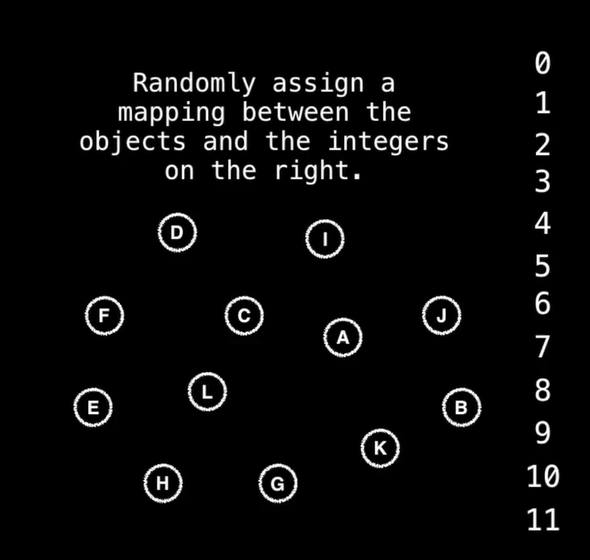

Create an array, each index to have an object associated to it (through mapping)

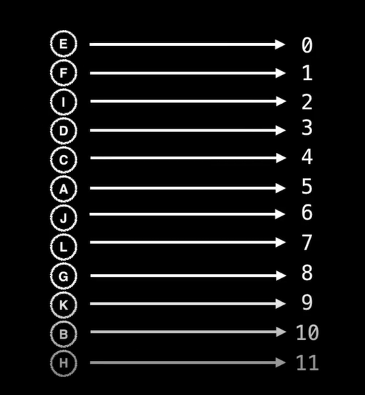

Top is array we created, in the center is a visual representation. Currently,
every node is a root node. We will change the value of the array to map to some
other letter. 

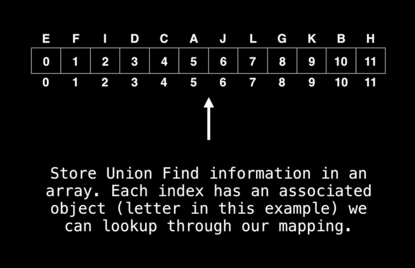

If we want to unify C and K, C root node = 5, K root node = 9, either C will
become K's parent or vice versa.

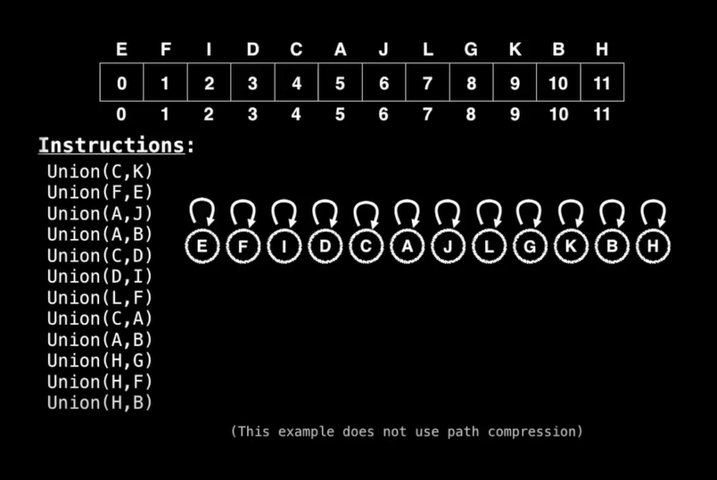

Similarly, for E and F.

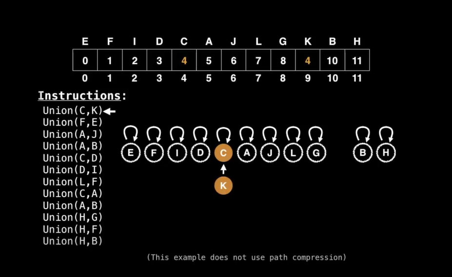

And So on...

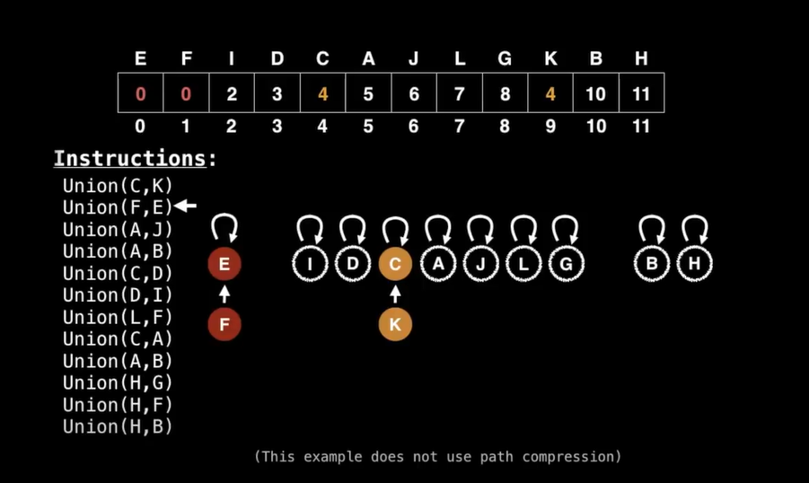

Now we want to unify A and B

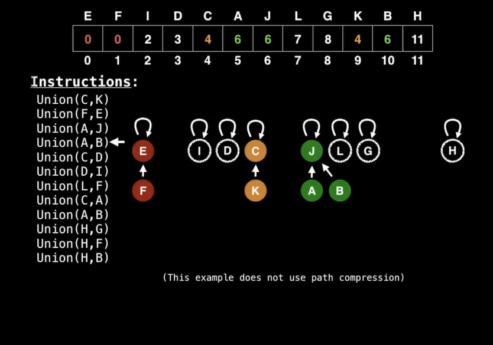

Now...

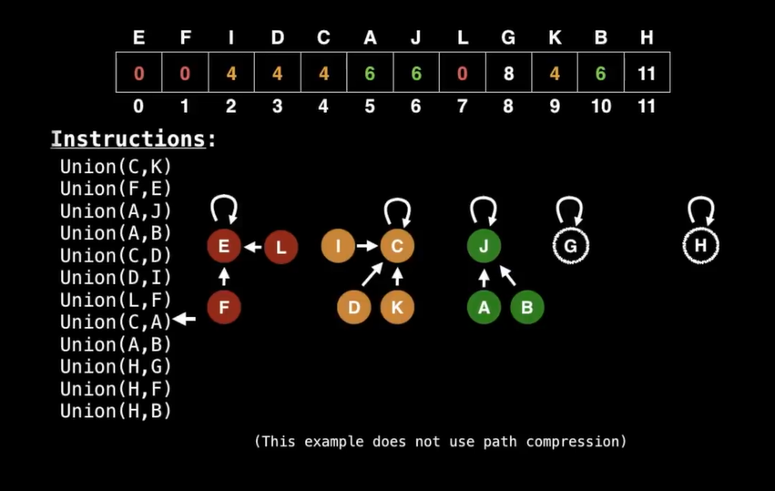

Join the group with lesser component to the group with higher component.

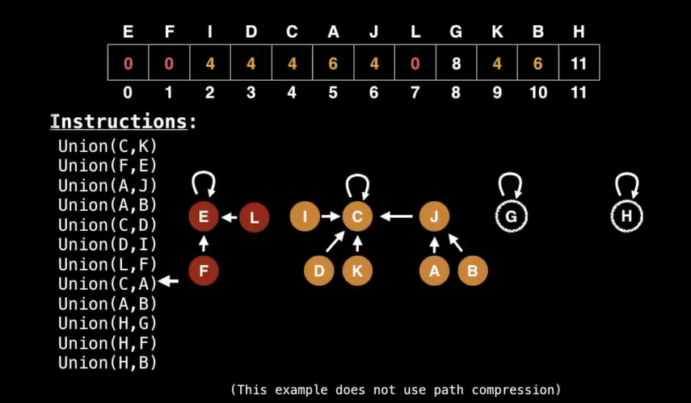

and so on...

# Note and Summary

Not using path compression, in this technique, which is ano optimisation.

Summary:

* To find which component a particular element belongs to find the root of that component by following the parent nodes until a self loop is reached (a node whose parent is itself)

* To unify two elements, find which are the root nodes of each component and if the root nodes are different make one of the root nodes be the parent of the other.

### Remark

In this data structure, we do not "un-union" elements. Inefficient since we
would have to update all the children of a node.

The number of components equal to the number of roots remaining. Also remark
that the number of root nodes never increases.

Our curren version of Union find does not support the nice `a(n)` time complexity since it does not have `PATH COMPRESSION`

# Union Find with Path Compression

Gives the amortized `a(n)` time complexity.

## Hypothetical Union Find path compression example

Suppose we want to unify nodes E and L...

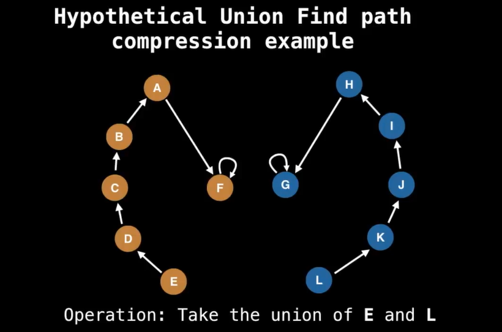

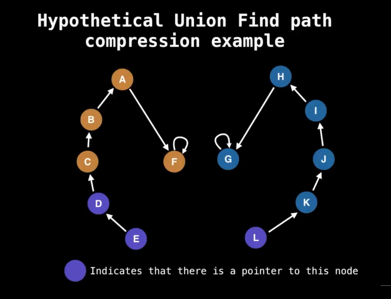

This is what path compression looks like: Traverse up from E to find its root.
Then directly point it to the root.

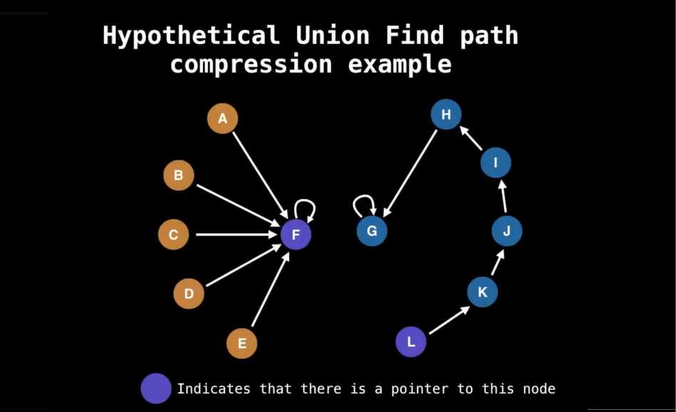

When we do a find operation, we do not have to traverse a path but immedieately
point to it which is almost linear time. Unify both the group now...

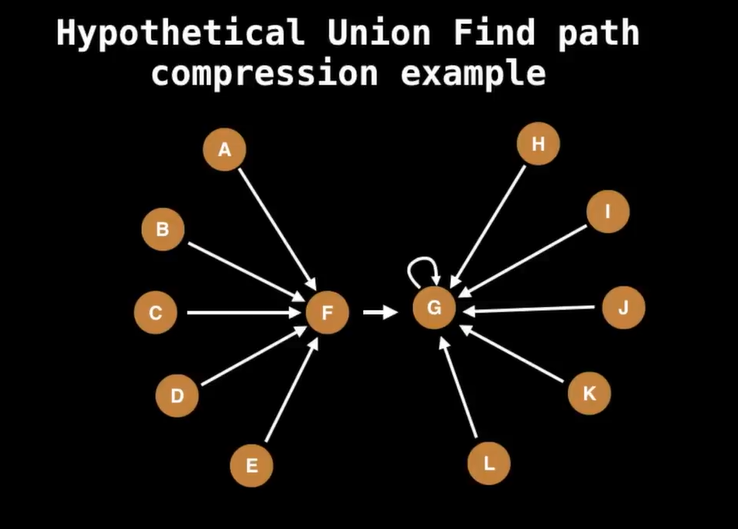

## Another example

Without path compression...

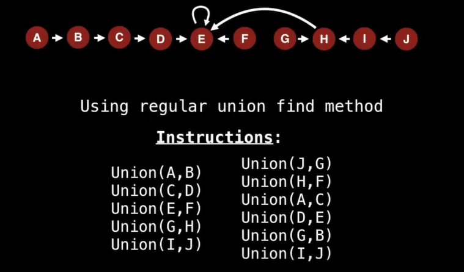

With path compression...

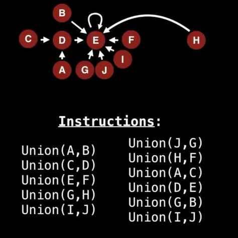

# Code Implementation (Notes)

WIP

