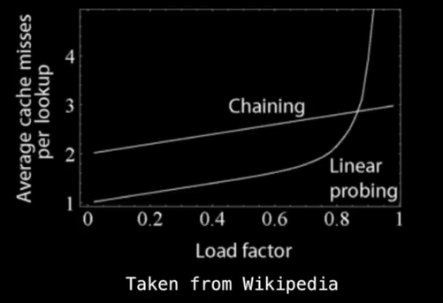

# Hash Tables

## What is Hash Table (HT) and what is Hash function?

A HT is a data structure that provides a mapping from KEYS to VALUES using a
techinque called hashing.

| KEY       | VALUE         |
|-----------|---------------|
| William   | green         |
| Michael   | red           |
| Janardhan | rainbow color |

These  are called key value pairs.

Keys must be unique, values don't


Often used to track item frequencies. But any mapping can exist as long as keys
are hashable

## Hash Functions

A hash function `H(x)` is a function that maps a key `x` to a whole number in a
fixed range.

Example:

```
H(x) = x^2 - 6x + 9
```

Notice values are not unique.

Hash functions can be defined not just on numeric types, but really any type.
For example, for ASCII data...

```
H(x) = ASCII_VALUE_OFF(x)
```

### Example

| Name | Age | Sex | Hash |
|------|-----|-----|------|
| Ram  | 13  | M   | ???  |

Hash function could be:

```
H(x) = age + length(name) + sex + 1
```

## Properties of Hash Functions

* If H(x) = H(y), then x and y may be equal.

* If H(x) =/= H(y), then x and y are not equal.

### Example

Comparing two files can be checked if equal by comparing their hash values. Git
does this. The hash functions for files are sophisiticated cryptographic hash
functions and checksums.

* Must be deterministic. (Memoryless)

* A hash collision is when two objects x and y hash to the same values. We try very hard to make the hash function *uniform*


### What makes a key of type T hashable?

To enfore deteriministic behaviour, a lot of OSes make the key used in hash
tables immutable.


## How does the hash table work?

Quick insertions, lookup, removal time desired. O(1) achievable using a hash function as a way to index a hash table. (Only if hash function is well uniform)

Let hash function be

```
H(x) = x^2 + 3 mod 10
```
To insert 3, we hash the key and find out where it goes in the table.

```
H(x) = 9 + 3 mod 10
     = 2
```

Insert in 2

|   | Key | Value |
|---|-----|-------|
| 1 |     |       |
| 2 | 3   | Three |
| 3 |     |       |
| 4 |     |       |
| 5 |     |       |
| 6 |     |       |


## Collision Resolution Methods

2 and 8 have the same value, how do we handle the Collision?

Use techniques - Separate chaining or Open Addressing

### Seperate Chaining

Maintain a linked list to hold all the different values which hashed to a
particular value.

### Open Addressing

Finding another place within the hash table for the object to go by offsetting
it from the position to which it hashed to.

## Complexity Analysis

| Operation | Average | Worst |
|-----------|---------|-------|
| Insertion | O(1)    | O(n)  |
| Removal   | O(1)    | O(n)  |
| Search    | O(1)    | O(n)  |

## Separate chaining implementaion details

Hash collision resolution technique. 

Maintains an aux datastructure to hold all the collisions. We can check there
to find the object we are looking for. Usually used with a linked list.

### Linked List approach view

**Data:**

| Name      | Age     | Hash  |
|-----------|---------|-------|
| A         |  10     |  3    |
| B         |  20     |  4    |
| C         |  33     |  3    |
| D         |  33     |  2    |
| E         |  33     |  2    |

Elements of the array in the hash table are just nodes of a linked list.
 
| Hash | Name(Parent) | Name(Next)  |
|------|--------------|-------------|
| 1    |              |             |
| 2    |   D          |   E         |
| 3    |   A          |   C         |
| 4    |   B          |             |


### Separate chaining FAQ

* How do you maintain O(1) if the hash table is full?

Create a new hash table of larger size. 

* Bucket behaviour data structure?

Arrays, BT, Self balancing trees are also possible apart from linked lists.

## Open addressing techniques

When using open addressing , the key value pairs are stored in the table
itself, not an auxilliary data structure. Size of table is important.

```
Load Factor = items in table / size of table
```



The O(1) constant time behaviour attributed to hash tables assumes the load
factor (a) is kept below a certain fixed value. Once a > `threshold`, we need
to grow the table size (ideally, exponentially. eg. double)

### Main Idea

When collision, we use a probing sequence `p(x)` to offset the current `x`
until we find an open position in the hash table.

* Linear probing

```
P(x) = ax + b
```

* Quadratic probing

```
P(x) = ax^2 + bx + c
```

* Double hashing

```
P(k,x) = x*H2(k) 
```

Where H2(k) is a secondary hash function

* Pseudo random number generator

```
P(k,x) = x*RNG(H(),x)
```

Where RNG is a random number generator seeded with H(k)


### Algorithm

```
x=1
keyHash = H(k)
index = keyHash

while table[index] != null:
  index = (keyHash + P(k,x)) mod N
  x = x + 1

insert (k,v) at table[index]
```

### Chaos with Cycles

Most probing sequences will produce some sort of cycle, if all the outputs in
these cycles are filled, you will be stuck in an INFINITE LOOP.

* How do we handle this issue?

We don't. We just choose a probing functions which produce a cycle of exactly
length N. There are a few exception...

Linear probing, quadratic probing, double hashing are all subject to this
issue. *Probing functions used with these methods are very specific.*


# Linear Probing

## What is Linear Probing

Formula:

```
P(x) = ax + b
```

Some linear functions are unable to produce a full cycle of size N.

Example:

```
P(x) = 3x
H(k) = 3
Table Size = N = 9

H(k) + P(0) mod N = 4
H(k) + P(1) mod N = 7
H(k) + P(2) mod N = 1
H(k) + P(3) mod N = 4
H(k) + P(4) mod N = 7
H(k) + P(5) mod N = 1
```
 
The cycle {4,7,1} makes it impossible to reach the buckets {0,2,3,5,6,8}.
This would create an infinite loop if all the buckets {4,7,1} are full.


## Problem 

Which values of a in `P(x) = ax+b` produce a full cycle modulo N?

Make sure a and N are relatively prime. (HCF is equal to one). Then full cycle
is achievable.

## Example

```
Table size = 9
P(x) = 6x
Max load factor = a = 0.667
Threshold before resize = a*N = 0.66*9 = 6
```
We are likely to run into an infinite loop. (`HCF(6,9) = 3`)


## FAQ

* How to remove key value pairs from the hash table?

Non trival


# Quadratic Probing

```
P(x) = ax2 + bx + c
```

The constant `c` is obsolete.

## How to avoid infinite loop?

### One

Let `P(x) = x^2`, keep the table size a prime > 3, keep `a < 0.5`

### Two

Let `P(x) = (x^2 + x)/2` and keep the table size a power of two.

### Three

Let `P(x) = (-1^x)*x^2` and keep the table size a prime N where N = 3 mod 4


# Double hashing

## What is double hashing?

DH is a probing method which probes according to a constant multiple of another
hash function.

```
P(k,x) = x*H2(k)
```

where H2(k) is a second hash function of the same type as the primary H(k)

Note: It reduces to linear probing at runtime. Same problem of infinite loop as
in linear probing.

## How to avoid infinite loops?

Pick table size a prime number. Let delta...

```
delta = H2(k) mod N
```

Then, if delta = 0, then we are guarenteed to be stuck in a cycle, so when this
happens, set delta=1.


Notice that 1<= delta <= N and HCF(delta,N) = 1, since N is prime. Hence, with
these conditions, we know that modulo N the sequence...


```
H1(k), 
H1(k)+1*delta, 
H1(k)+2*delta, 
H1(k)+3*delta
...
```
is certain to have order N.

## Construction of H2(k)

Suppose the key k has type T

Whenever we use DH, H2(k) should also be able to hash T.

Systematic way of generation H2(k)? Universal hash functions.

## Strategies to increase the table size

Suppose load exceeded threshold,

N needs to be doubled, but it won't be prime. Choose N to be the next prime
number after 2*N

# Removing elements from HT using Open Addressing

## Issues with removing

```
insert(k1,v1)
insert(k2,v2)
insert(k3,v3)
remove(k2)
getValue(k3)
```

Let H(k1), H(k2), H(k3) = 1.

Once removed k2, getValue(k3) will stop when probing reaches k2 as its value
would be null.

## Solution

Place tombstone when removing elements, when searching, skip over the
tombstone.


## FAQ

Tombstones count as filled, increasing the load factor. Kill all tombstones,
only when resizeing the hashtable. When inserting, just replace the tombstone
with a new key-value pair.


